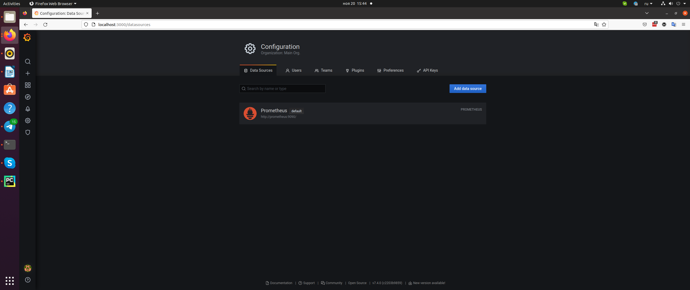
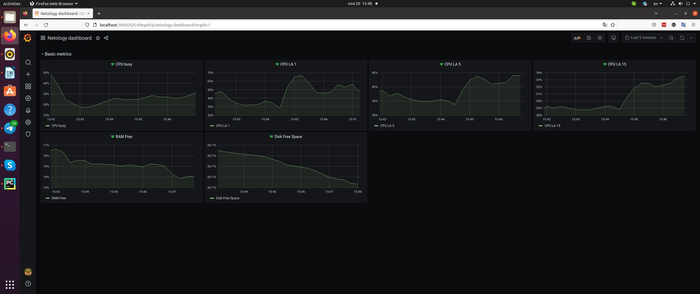

# Домашнее задание к занятию "10.03. Grafana"

## Обязательные задания

### Задание 1

#### Вопрос 

Используя директорию [help](./help) внутри данного домашнего задания - запустите связку prometheus-grafana.

Зайдите в веб-интерфейс графана, используя авторизационные данные, указанные в манифесте docker-compose.

Подключите поднятый вами prometheus как источник данных.

Решение домашнего задания - скриншот веб-интерфейса grafana со списком подключенных Datasource.

#### Ответ

## Задание 2

#### Вопрос

Изучите самостоятельно ресурсы:
- [PromQL query to find CPU and memory](https://stackoverflow.com/questions/62770744/promql-query-to-find-cpu-and-memory-used-for-the-last-week)
- [PromQL tutorial](https://valyala.medium.com/promql-tutorial-for-beginners-9ab455142085)
- [Understanding Prometheus CPU metrics](https://www.robustperception.io/understanding-machine-cpu-usage)

Создайте Dashboard и в ней создайте следующие Panels:
- Утилизация CPU для nodeexporter (в процентах, 100-idle)
- CPULA 1/5/15
- Количество свободной оперативной памяти
- Количество места на файловой системе

Для решения данного ДЗ приведите promql запросы для выдачи этих метрик, а также скриншот получившейся Dashboard.

#### Ответ

**Утилизация CPU для nodeexporter (в процентах, 100-idle)**

100 - avg by (instance) (rate(node_cpu_seconds_total{mode="idle"}[1m]))*100

**CPULA 1/5/15**

avg(node_load1)  / count(count(node_cpu_seconds_total) by (cpu)) * 100

avg(node_load5)  / count(count(node_cpu_seconds_total) by (cpu)) * 100

avg(node_load15) / count(count(node_cpu_seconds_total) by (cpu)) * 100

**Количество свободной оперативной памяти**

node_memory_MemFree_bytes / node_memory_MemTotal_bytes * 100

**Количество места на файловой системе**

node_filesystem_free_bytes{mountpoint="/"} / node_filesystem_size_bytes{mountpoint="/"} * 100

## Задание 3

#### Вопрос

Создайте для каждой Dashboard подходящее правило alert (можно обратиться к первой лекции в блоке "Мониторинг").
Для решения ДЗ - приведите скриншот вашей итоговой Dashboard.

#### Ответ

## Задание 4

#### Вопрос

Сохраните ваш Dashboard.

Для этого перейдите в настройки Dashboard, выберите в боковом меню "JSON MODEL".

Далее скопируйте отображаемое json-содержимое в отдельный файл и сохраните его.

В решении задания - приведите листинг этого файла.

#### Ответ

[NetologyDash.json](src/NetologyDash.json)